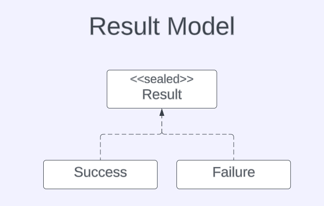
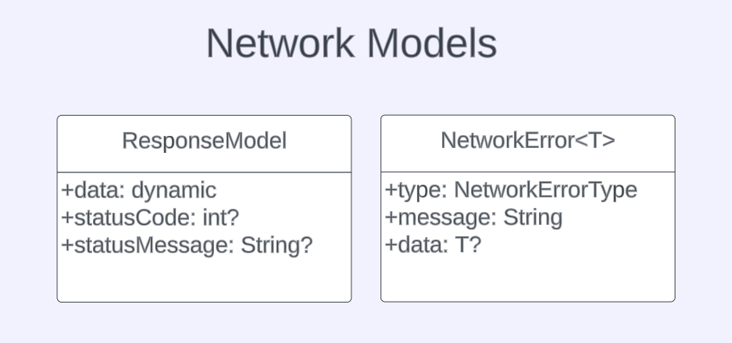

# Basic Network Layer in Flutter

## Giriş
Kodlara geçmeden önce kısaca bir sayfanın nasıl çalıştığından bahsetmek istiyorum. 
Genel olarak bir sayfa View, ViewModel, Model ve Service sınıflarından oluşur. 
View'da zaten widgetlar var. ViewModel'de sayfada çalışan fonksiyonlar var. Model sayfada kullanılan data sınıflar. Service sınıfı da sayfadaki network requestlerini yapan sınıftır. Daha farklı yaklaşımlar da var ama ben yaptığım örneklerde bu yapıyı kullandım. Bu açıklamadan çok bir şey anlamadıysanız sorun değil, birazdan örneklerle çok daha iyi anlayacağınıza eminim. 

## Result Class
Result adında sealed bir class oluşturdum. Bu class'ı inherit eden 2 tane class var, biri Success biri Failure. Bu sayede yapılan işlemin sonucuna göre fonksiyonlar geriye Success veya Failure döndürebiliyor. 
 

## UI States
Bir request attıktan sonra sayfada oluşabilecek değişiklikleri göstermek için ResponseState adında sealed bir class oluşturdum. Bu sayede request attıktan sonra meydana gelen değişiklikleri sayfada rahatlıkla gösterebiliriz.

## Network Models
Network katmanını yaparken [dio](https://pub.dev/packages/dio) paketini kullandım ama bu pakete bağlı kalmamak için kendi response ve error modelimi oluşturdum. 
 

## JSON Parsing Layer
Bence JSON parsing işlemi network katmanında yapılmamalı. Network katmanının tek görevi request atmak ve geriye response döndürmek olmalı. Bu yüzden parsing kısmını farklı bir class'ta yapıyorum. Parsing sınıfı gelen response'un status koduna bakarak datayı parse etmekten sorumlu. Örneğin; 
status code == 200 ise datayı UserModel sınıfına parse et 
status code == 401 ise token'ın süresi bitti diye bir error döndür 
status code == 404 ise datayı CustomErrorModel sınıfına parse et 

## Example
 

