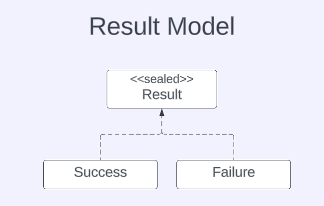
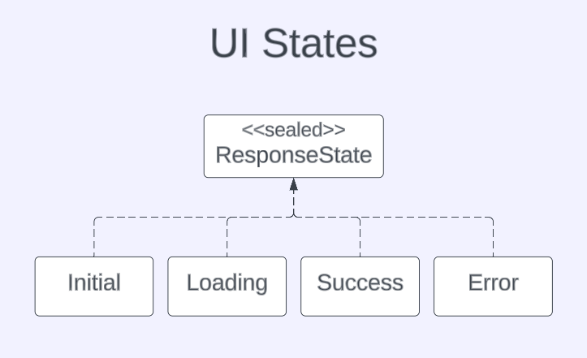
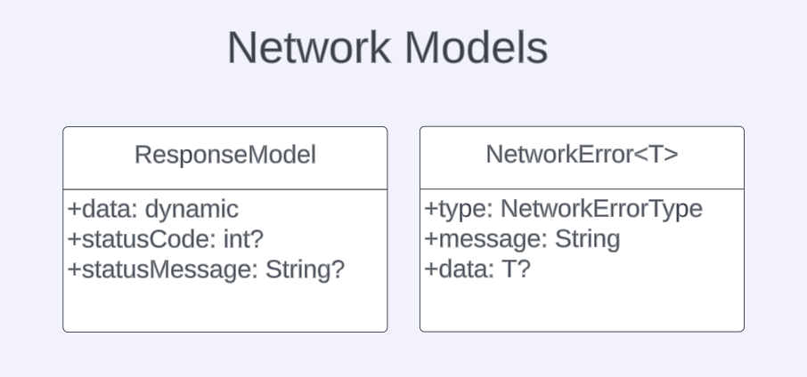
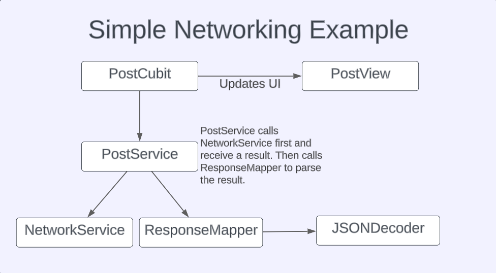

# Basic Network Layer in Flutter

## Introduction
Before moving on to the codes, I would like to briefly talk about how a page works. 
Generally, a page consists of the View, ViewModel, Model, and Service classes. 
View has widgets. In the ViewModel there are functions that run on the page. The Model is data class used on the page.Service class makes the network requests on the page. There are different approaches, but I used this structure in the examples. It's okay if you don't understand much from this explanation, I'm sure you will understand much better with examples soon. 

## Result Class
I created a sealed class named Result. Success and Failure classes inherit from the Result clas. Thus, functions are able to return Success or Failure.
 

## UI States
I created a sealed class called ResponseState to show the changes that may occur on the page after making a request. In this way, we can easily show the changes that occur after the request is made on the page. 
 

## Network Models
I used [dio package](https://pub.dev/packages/dio) but I didn't want to depend on it, so I created my own response and error models. 
 

## JSON Parsing Layer
I think JSON parsing should not be done in the network layer. The only task of the network layer should be to make a request and return a response. So I'm doing the parsing part in a different class. The Parsing class is responsible for parsing the data by looking at the status code of the incoming response. For example; 
if status code == 200 parse data to UserModel class 
if status code == 401 return token expired error 
if status code == 404 parse data to CustomErrorModel class 

## Example
 

